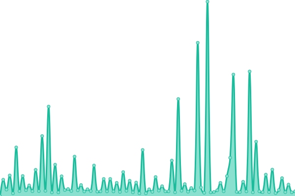
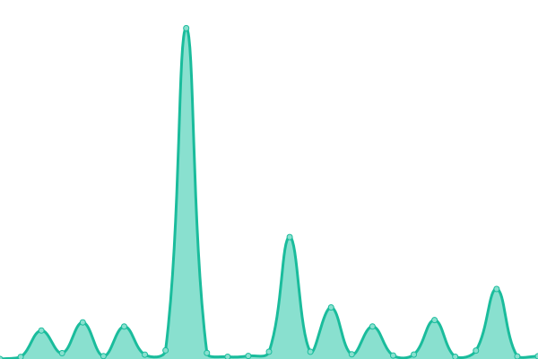
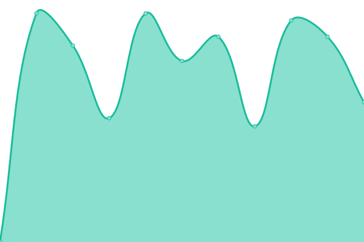

# [📈 Live Status](https://HDVinnie.github.io/TrackerHub): <!--live status--> **🟧 Partial outage**

This repository contains the open-source uptime monitor and status page for [HDVinnie](https://HDVinnie.github.io/TrackerHub), powered by [Upptime](https://github.com/upptime/upptime).

With [Upptime](https://upptime.js.org), you can get your own unlimited and free uptime monitor and status page, powered entirely by a GitHub repository. We use [Issues](https://github.com/HDVinnie/TrackerHub/issues) as incident reports, [Actions](https://github.com/HDVinnie/TrackerHub/actions) as uptime monitors, and [Pages](https://HDVinnie.github.io/TrackerHub) for the status page.

<!--start: status pages-->
<!-- This summary is generated by Upptime (https://github.com/upptime/upptime) -->
<!-- Do not edit this manually, your changes will be overwritten -->
<!-- prettier-ignore -->
| URL | Status | History | Response Time | Uptime |
| --- | ------ | ------- | ------------- | ------ |
|  Aither | 🟩 Up | [aither.yml](https://github.com/HDVinnie/TrackerHub/commits/HEAD/history/aither.yml) | 

 489ms
     
 | 

<a href="https://HDVinnie.github.io/TrackerHub/history/aither">100.00%</a>
    

|  AlphaRatio | 🟩 Up | [alpha-ratio.yml](https://github.com/HDVinnie/TrackerHub/commits/HEAD/history/alpha-ratio.yml) | 

 1217ms
     
 | 

<a href="https://HDVinnie.github.io/TrackerHub/history/alpha-ratio">90.99%</a>
    

|  AnimeBytes | 🟩 Up | [anime-bytes.yml](https://github.com/HDVinnie/TrackerHub/commits/HEAD/history/anime-bytes.yml) | 

 369ms
     
 | 

<a href="https://HDVinnie.github.io/TrackerHub/history/anime-bytes">100.00%</a>
    

|  Anthelion | 🟩 Up | [anthelion.yml](https://github.com/HDVinnie/TrackerHub/commits/HEAD/history/anthelion.yml) | 

 451ms
     
 | 

<a href="https://HDVinnie.github.io/TrackerHub/history/anthelion">100.00%</a>
    

|  AsianCinema | 🟩 Up | [asian-cinema.yml](https://github.com/HDVinnie/TrackerHub/commits/HEAD/history/asian-cinema.yml) | 

 5168ms
     
 | 

<a href="https://HDVinnie.github.io/TrackerHub/history/asian-cinema">99.57%</a>
    

|  BeyondHD | 🟩 Up | [beyond-hd.yml](https://github.com/HDVinnie/TrackerHub/commits/HEAD/history/beyond-hd.yml) | 

 503ms
     
 | 

<a href="https://HDVinnie.github.io/TrackerHub/history/beyond-hd">100.00%</a>
    

|  Bibliotik | 🟩 Up | [bibliotik.yml](https://github.com/HDVinnie/TrackerHub/commits/HEAD/history/bibliotik.yml) | 

 208ms
     
 | 

<a href="https://HDVinnie.github.io/TrackerHub/history/bibliotik">100.00%</a>
    

|  Blutopia | 🟩 Up | [blutopia.yml](https://github.com/HDVinnie/TrackerHub/commits/HEAD/history/blutopia.yml) | 

 299ms
     
 | 

<a href="https://HDVinnie.github.io/TrackerHub/history/blutopia">99.57%</a>
    

|  BroadcasTheNet | 🟩 Up | [broadcas-the-net.yml](https://github.com/HDVinnie/TrackerHub/commits/HEAD/history/broadcas-the-net.yml) | 

 263ms
     
 | 

<a href="https://HDVinnie.github.io/TrackerHub/history/broadcas-the-net">100.00%</a>
    

|  DesiTorrents | 🟩 Up | [desi-torrents.yml](https://github.com/HDVinnie/TrackerHub/commits/HEAD/history/desi-torrents.yml) | 

 1612ms
     
 | 

<a href="https://HDVinnie.github.io/TrackerHub/history/desi-torrents">98.76%</a>
    

|  Empornium | 🟩 Up | [empornium.yml](https://github.com/HDVinnie/TrackerHub/commits/HEAD/history/empornium.yml) | 

 466ms
     
 | 

<a href="https://HDVinnie.github.io/TrackerHub/history/empornium">99.72%</a>
    

|  Exoticaz | 🟩 Up | [exoticaz.yml](https://github.com/HDVinnie/TrackerHub/commits/HEAD/history/exoticaz.yml) | 

 446ms
     
 | 

<a href="https://HDVinnie.github.io/TrackerHub/history/exoticaz">25.82%</a>
    

|  GazelleGames | 🟩 Up | [gazelle-games.yml](https://github.com/HDVinnie/TrackerHub/commits/HEAD/history/gazelle-games.yml) | 

 533ms
     
 | 

<a href="https://HDVinnie.github.io/TrackerHub/history/gazelle-games">100.00%</a>
    

|  GreatPosterWall | 🟩 Up | [great-poster-wall.yml](https://github.com/HDVinnie/TrackerHub/commits/HEAD/history/great-poster-wall.yml) | 

 934ms
     
 | 

<a href="https://HDVinnie.github.io/TrackerHub/history/great-poster-wall">100.00%</a>
    

|  HDBits | 🟩 Up | [hd-bits.yml](https://github.com/HDVinnie/TrackerHub/commits/HEAD/history/hd-bits.yml) | 

 653ms
     
 | 

<a href="https://HDVinnie.github.io/TrackerHub/history/hd-bits">100.00%</a>
    

|  MorethanTV | 🟩 Up | [morethan-tv.yml](https://github.com/HDVinnie/TrackerHub/commits/HEAD/history/morethan-tv.yml) | 

 238ms
     
 | 

<a href="https://HDVinnie.github.io/TrackerHub/history/morethan-tv">100.00%</a>
    

|  MyAnonaMouse | 🟩 Up | [my-anona-mouse.yml](https://github.com/HDVinnie/TrackerHub/commits/HEAD/history/my-anona-mouse.yml) | 

 654ms
     
 | 

<a href="https://HDVinnie.github.io/TrackerHub/history/my-anona-mouse">100.00%</a>
    

|  Nebulance | 🟩 Up | [nebulance.yml](https://github.com/HDVinnie/TrackerHub/commits/HEAD/history/nebulance.yml) | 

 644ms
     
 | 

<a href="https://HDVinnie.github.io/TrackerHub/history/nebulance">99.74%</a>
    

|  Orpheus | 🟩 Up | [orpheus.yml](https://github.com/HDVinnie/TrackerHub/commits/HEAD/history/orpheus.yml) | 

 537ms
     
 | 

<a href="https://HDVinnie.github.io/TrackerHub/history/orpheus">100.00%</a>
    

|  PrivateHD | 🟩 Up | [private-hd.yml](https://github.com/HDVinnie/TrackerHub/commits/HEAD/history/private-hd.yml) | 

 224ms
     
 | 

<a href="https://HDVinnie.github.io/TrackerHub/history/private-hd">100.00%</a>
    

|  PassThePopcorn | 🟩 Up | [pass-the-popcorn.yml](https://github.com/HDVinnie/TrackerHub/commits/HEAD/history/pass-the-popcorn.yml) | 

 262ms
     
 | 

<a href="https://HDVinnie.github.io/TrackerHub/history/pass-the-popcorn">100.00%</a>
    

|  Redacted | 🟩 Up | [redacted.yml](https://github.com/HDVinnie/TrackerHub/commits/HEAD/history/redacted.yml) | 

 2109ms
     
 | 

<a href="https://HDVinnie.github.io/TrackerHub/history/redacted">99.54%</a>
    

|  SceneTime | 🟩 Up | [scene-time.yml](https://github.com/HDVinnie/TrackerHub/commits/HEAD/history/scene-time.yml) | 

 2135ms
     
 | 

<a href="https://HDVinnie.github.io/TrackerHub/history/scene-time">54.20%</a>
    

|  Secret-Cinema | 🟩 Up | [secret-cinema.yml](https://github.com/HDVinnie/TrackerHub/commits/HEAD/history/secret-cinema.yml) | 

 581ms
     
 | 

<a href="https://HDVinnie.github.io/TrackerHub/history/secret-cinema">100.00%</a>
    

|  SkipTheCommericals | 🟥 Down | [skip-the-commericals.yml](https://github.com/HDVinnie/TrackerHub/commits/HEAD/history/skip-the-commericals.yml) | 

 701ms
     
 | 

<a href="https://HDVinnie.github.io/TrackerHub/history/skip-the-commericals">71.51%</a>
    

|  SkipTheTrailers | 🟩 Up | [skip-the-trailers.yml](https://github.com/HDVinnie/TrackerHub/commits/HEAD/history/skip-the-trailers.yml) | 

 571ms
     
 | 

<a href="https://HDVinnie.github.io/TrackerHub/history/skip-the-trailers">70.60%</a>
    

|  Telly | 🟩 Up | [telly.yml](https://github.com/HDVinnie/TrackerHub/commits/HEAD/history/telly.yml) | 

 637ms
     
 | 

<a href="https://HDVinnie.github.io/TrackerHub/history/telly">71.60%</a>
    

|  TorrentLeech | 🟩 Up | [torrent-leech.yml](https://github.com/HDVinnie/TrackerHub/commits/HEAD/history/torrent-leech.yml) | 

 341ms
     
 | 

<a href="https://HDVinnie.github.io/TrackerHub/history/torrent-leech">100.00%</a>
    

|  TV-Vault | 🟨 Degraded | [tv-vault.yml](https://github.com/HDVinnie/TrackerHub/commits/HEAD/history/tv-vault.yml) | 

 24366ms
     
 | 

<a href="https://HDVinnie.github.io/TrackerHub/history/tv-vault">0.00%</a>
    

|  UHDBits | 🟩 Up | [uhd-bits.yml](https://github.com/HDVinnie/TrackerHub/commits/HEAD/history/uhd-bits.yml) | 

 669ms
     
 | 

<a href="https://HDVinnie.github.io/TrackerHub/history/uhd-bits">100.00%</a>
    

<!--end: status pages-->

[**Visit our status website →**](https://HDVinnie.github.io/TrackerHub)

## 📄 License

- Powered by: [Upptime](https://github.com/upptime/upptime)
- Code: [MIT](./LICENSE) © [HDVinnie](https://HDVinnie.github.io/TrackerHub)
- Data in the `./history` directory: [Open Database License](https://opendatacommons.org/licenses/odbl/1-0/)
