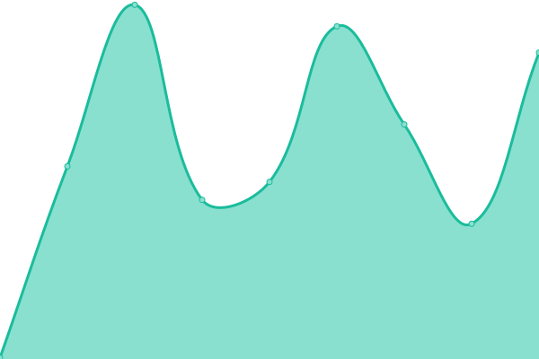
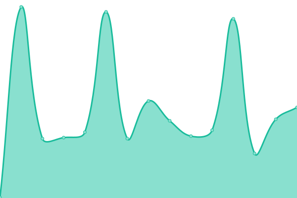

# [📈 Live Status](https://HDVinnie.github.io/TrackerHub): <!--live status--> **🟧 Partial outage**

This repository contains the open-source uptime monitor and status page for [HDVinnie](https://HDVinnie.github.io/TrackerHub), powered by [Upptime](https://github.com/upptime/upptime).

With [Upptime](https://upptime.js.org), you can get your own unlimited and free uptime monitor and status page, powered entirely by a GitHub repository. We use [Issues](https://github.com/HDVinnie/TrackerHub/issues) as incident reports, [Actions](https://github.com/HDVinnie/TrackerHub/actions) as uptime monitors, and [Pages](https://HDVinnie.github.io/TrackerHub) for the status page.

<!--start: status pages-->
<!-- This summary is generated by Upptime (https://github.com/upptime/upptime) -->
<!-- Do not edit this manually, your changes will be overwritten -->
<!-- prettier-ignore -->
| URL | Status | History | Response Time | Uptime |
| --- | ------ | ------- | ------------- | ------ |
|  BeyondHD | 🟩 Up | [beyond-hd.yml](https://github.com/HDVinnie/TrackerHub/commits/HEAD/history/beyond-hd.yml) | 

 467ms
     
 | 

<a href="https://HDVinnie.github.io/TrackerHub/history/beyond-hd">94.10%</a>
    

|  Blutopia | 🟩 Up | [blutopia.yml](https://github.com/HDVinnie/TrackerHub/commits/HEAD/history/blutopia.yml) | 

 346ms
     
 | 

<a href="https://HDVinnie.github.io/TrackerHub/history/blutopia">100.00%</a>
    

|  BroadcasTheNet | 🟩 Up | [broadcas-the-net.yml](https://github.com/HDVinnie/TrackerHub/commits/HEAD/history/broadcas-the-net.yml) | 

 293ms
     
 | 

<a href="https://HDVinnie.github.io/TrackerHub/history/broadcas-the-net">97.64%</a>
    

|  BroadcasTheNet Announce | 🟩 Up | [broadcas-the-net-announce.yml](https://github.com/HDVinnie/TrackerHub/commits/HEAD/history/broadcas-the-net-announce.yml) | 

 241ms
     
 | 

<a href="https://HDVinnie.github.io/TrackerHub/history/broadcas-the-net-announce">62.92%</a>
    

|  HDBits | 🟩 Up | [hd-bits.yml](https://github.com/HDVinnie/TrackerHub/commits/HEAD/history/hd-bits.yml) | 

 382ms
     
 | 

<a href="https://HDVinnie.github.io/TrackerHub/history/hd-bits">100.00%</a>
    

|  PrivateHD | 🟩 Up | [private-hd.yml](https://github.com/HDVinnie/TrackerHub/commits/HEAD/history/private-hd.yml) | 

 818ms
     
 | 

<a href="https://HDVinnie.github.io/TrackerHub/history/private-hd">97.64%</a>
    

|  PrivateHD Announce | 🟩 Up | [private-hd-announce.yml](https://github.com/HDVinnie/TrackerHub/commits/HEAD/history/private-hd-announce.yml) | 

 229ms
     
 | 

<a href="https://HDVinnie.github.io/TrackerHub/history/private-hd-announce">36.26%</a>
    

|  PassThePopcorn | 🟩 Up | [pass-the-popcorn.yml](https://github.com/HDVinnie/TrackerHub/commits/HEAD/history/pass-the-popcorn.yml) | 

 235ms
     
 | 

<a href="https://HDVinnie.github.io/TrackerHub/history/pass-the-popcorn">97.64%</a>
    

|  PassThePopcorn Announce | 🟥 Down | [pass-the-popcorn-announce.yml](https://github.com/HDVinnie/TrackerHub/commits/HEAD/history/pass-the-popcorn-announce.yml) | 

 1253ms
     
 | 

<a href="https://HDVinnie.github.io/TrackerHub/history/pass-the-popcorn-announce">35.64%</a>
    

|  Redacted | 🟩 Up | [redacted.yml](https://github.com/HDVinnie/TrackerHub/commits/HEAD/history/redacted.yml) | 

 202ms
     
 | 

<a href="https://HDVinnie.github.io/TrackerHub/history/redacted">100.00%</a>
    

|  Redacted Announce | 🟩 Up | [redacted-announce.yml](https://github.com/HDVinnie/TrackerHub/commits/HEAD/history/redacted-announce.yml) | 

 219ms
     
 | 

<a href="https://HDVinnie.github.io/TrackerHub/history/redacted-announce">58.69%</a>
    

<!--end: status pages-->

[**Visit our status website →**](https://HDVinnie.github.io/TrackerHub)

## 📄 License

- Powered by: [Upptime](https://github.com/upptime/upptime)
- Code: [MIT](./LICENSE) © [HDVinnie](https://HDVinnie.github.io/TrackerHub)
- Data in the `./history` directory: [Open Database License](https://opendatacommons.org/licenses/odbl/1-0/)
