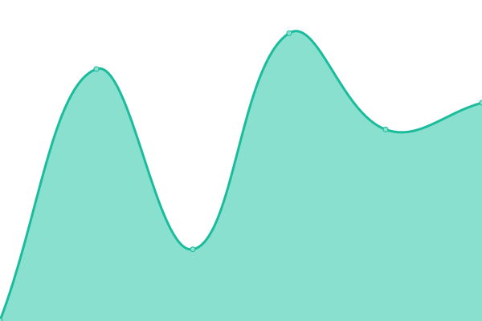
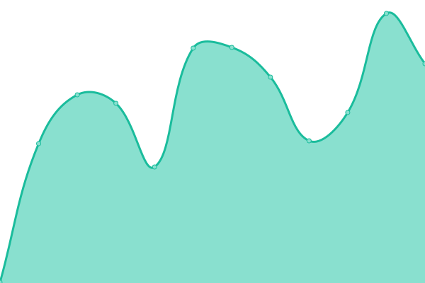
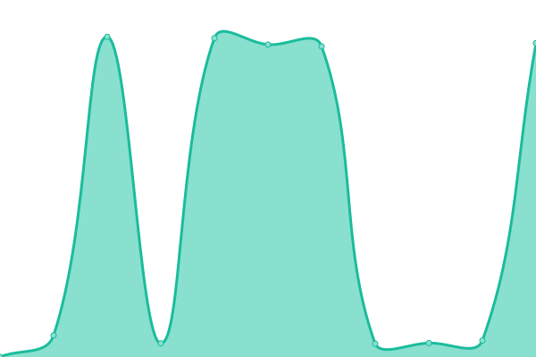

# [📈 Live Status](https://HDVinnie.github.io/TrackerHub): <!--live status--> **🟧 Partial outage**

This repository contains the open-source uptime monitor and status page for [HDVinnie](https://HDVinnie.github.io/TrackerHub), powered by [Upptime](https://github.com/upptime/upptime).

With [Upptime](https://upptime.js.org), you can get your own unlimited and free uptime monitor and status page, powered entirely by a GitHub repository. We use [Issues](https://github.com/HDVinnie/TrackerHub/issues) as incident reports, [Actions](https://github.com/HDVinnie/TrackerHub/actions) as uptime monitors, and [Pages](https://HDVinnie.github.io/TrackerHub) for the status page.

<!--start: status pages-->
<!-- This summary is generated by Upptime (https://github.com/upptime/upptime) -->
<!-- Do not edit this manually, your changes will be overwritten -->
<!-- prettier-ignore -->
| URL | Status | History | Response Time | Uptime |
| --- | ------ | ------- | ------------- | ------ |
|  BHD | 🟩 Up | [bhd.yml](https://github.com/HDVinnie/TrackerHub/commits/HEAD/history/bhd.yml) | 

 530ms
     
 | 

<a href="https://HDVinnie.github.io/TrackerHub/history/bhd">100.00%</a>
    

|  BLU | 🟩 Up | [blu.yml](https://github.com/HDVinnie/TrackerHub/commits/HEAD/history/blu.yml) | 

 337ms
     
 | 

<a href="https://HDVinnie.github.io/TrackerHub/history/blu">100.00%</a>
    

|  BTN | 🟩 Up | [btn.yml](https://github.com/HDVinnie/TrackerHub/commits/HEAD/history/btn.yml) | 

 286ms
     
 | 

<a href="https://HDVinnie.github.io/TrackerHub/history/btn">100.00%</a>
    

|  BTN Announce | 🟥 Down | [btn-announce.yml](https://github.com/HDVinnie/TrackerHub/commits/HEAD/history/btn-announce.yml) | 

 209ms
     
 | 

<a href="https://HDVinnie.github.io/TrackerHub/history/btn-announce">84.22%</a>
    

|  HDB | 🟩 Up | [hdb.yml](https://github.com/HDVinnie/TrackerHub/commits/HEAD/history/hdb.yml) | 

 667ms
     
 | 

<a href="https://HDVinnie.github.io/TrackerHub/history/hdb">100.00%</a>
    

|  PTP | 🟩 Up | [ptp.yml](https://github.com/HDVinnie/TrackerHub/commits/HEAD/history/ptp.yml) | 

 253ms
     
 | 

<a href="https://HDVinnie.github.io/TrackerHub/history/ptp">100.00%</a>
    

|  PTP Announce | 🟩 Up | [ptp-announce.yml](https://github.com/HDVinnie/TrackerHub/commits/HEAD/history/ptp-announce.yml) | 

 2833ms
     
 | 

<a href="https://HDVinnie.github.io/TrackerHub/history/ptp-announce">64.72%</a>
    

<!--end: status pages-->

[**Visit our status website →**](https://HDVinnie.github.io/TrackerHub)

## 📄 License

- Powered by: [Upptime](https://github.com/upptime/upptime)
- Code: [MIT](./LICENSE) © [HDVinnie](https://HDVinnie.github.io/TrackerHub)
- Data in the `./history` directory: [Open Database License](https://opendatacommons.org/licenses/odbl/1-0/)
