# [📈 Live Status](https://HDVinnie.github.io/TrackerHub): <!--live status--> **🟧 Partial outage**

This repository contains the open-source uptime monitor and status page for [HDVinnie](https://HDVinnie.github.io/TrackerHub), powered by [Upptime](https://github.com/upptime/upptime).

With [Upptime](https://upptime.js.org), you can get your own unlimited and free uptime monitor and status page, powered entirely by a GitHub repository. We use [Issues](https://github.com/HDVinnie/TrackerHub/issues) as incident reports, [Actions](https://github.com/HDVinnie/TrackerHub/actions) as uptime monitors, and [Pages](https://HDVinnie.github.io/TrackerHub) for the status page.

<!--start: status pages-->
<!-- This summary is generated by Upptime (https://github.com/upptime/upptime) -->
<!-- Do not edit this manually, your changes will be overwritten -->
<!-- prettier-ignore -->
| URL | Status | History | Response Time | Uptime |
| --- | ------ | ------- | ------------- | ------ |
|  Aither | 🟨 Degraded | [aither.yml](https://github.com/HDVinnie/TrackerHub/commits/HEAD/history/aither.yml) | 

 1079ms
     
 | 

<a href="https://HDVinnie.github.io/TrackerHub/history/aither">61.86%</a>
    

|  AlphaRatio | 🟩 Up | [alpha-ratio.yml](https://github.com/HDVinnie/TrackerHub/commits/HEAD/history/alpha-ratio.yml) | 

 963ms
     
 | 

<a href="https://HDVinnie.github.io/TrackerHub/history/alpha-ratio">100.00%</a>
    

|  AnimeBytes | 🟩 Up | [anime-bytes.yml](https://github.com/HDVinnie/TrackerHub/commits/HEAD/history/anime-bytes.yml) | 

 885ms
     
 | 

<a href="https://HDVinnie.github.io/TrackerHub/history/anime-bytes">100.00%</a>
    

|  Anthelion | 🟩 Up | [anthelion.yml](https://github.com/HDVinnie/TrackerHub/commits/HEAD/history/anthelion.yml) | 

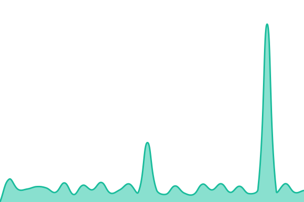 1364ms
     
 | 

<a href="https://HDVinnie.github.io/TrackerHub/history/anthelion">99.23%</a>
    

|  AsianCinema | 🟩 Up | [asian-cinema.yml](https://github.com/HDVinnie/TrackerHub/commits/HEAD/history/asian-cinema.yml) | 

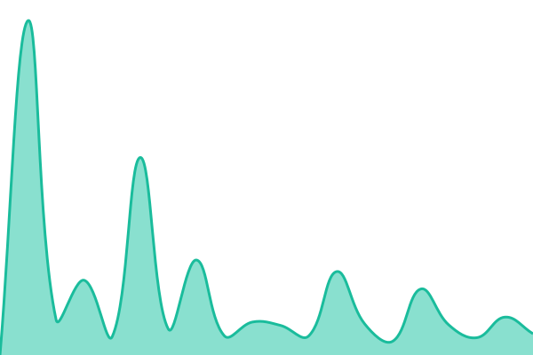 2075ms
     
 | 

<a href="https://HDVinnie.github.io/TrackerHub/history/asian-cinema">99.81%</a>
    

|  BeyondHD | 🟩 Up | [beyond-hd.yml](https://github.com/HDVinnie/TrackerHub/commits/HEAD/history/beyond-hd.yml) | 

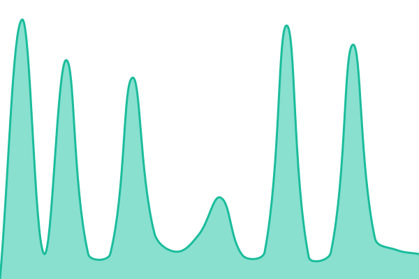 12181ms
     
 | 

<a href="https://HDVinnie.github.io/TrackerHub/history/beyond-hd">93.72%</a>
    

|  Bibliotik | 🟩 Up | [bibliotik.yml](https://github.com/HDVinnie/TrackerHub/commits/HEAD/history/bibliotik.yml) | 

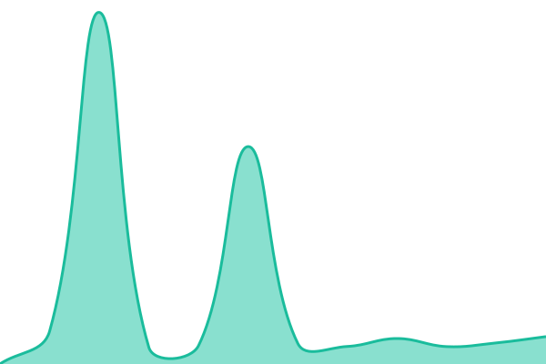 274ms
     
 | 

<a href="https://HDVinnie.github.io/TrackerHub/history/bibliotik">100.00%</a>
    

|  Blutopia | 🟩 Up | [blutopia.yml](https://github.com/HDVinnie/TrackerHub/commits/HEAD/history/blutopia.yml) | 

 450ms
     
 | 

<a href="https://HDVinnie.github.io/TrackerHub/history/blutopia">99.78%</a>
    

|  BroadcasTheNet | 🟩 Up | [broadcas-the-net.yml](https://github.com/HDVinnie/TrackerHub/commits/HEAD/history/broadcas-the-net.yml) | 

 1552ms
     
 | 

<a href="https://HDVinnie.github.io/TrackerHub/history/broadcas-the-net">100.00%</a>
    

|  DesiTorrents | 🟨 Degraded | [desi-torrents.yml](https://github.com/HDVinnie/TrackerHub/commits/HEAD/history/desi-torrents.yml) | 

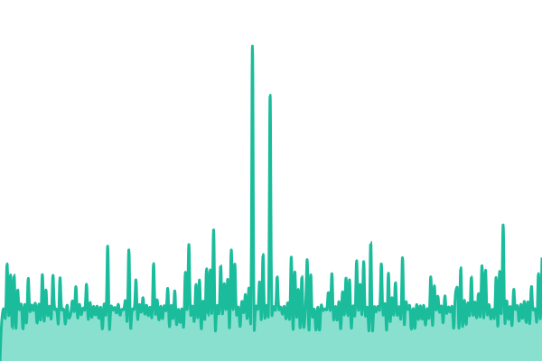 1051ms
     
 | 

<a href="https://HDVinnie.github.io/TrackerHub/history/desi-torrents">75.38%</a>
    

|  Empornium | 🟩 Up | [empornium.yml](https://github.com/HDVinnie/TrackerHub/commits/HEAD/history/empornium.yml) | 

 2248ms
     
 | 

<a href="https://HDVinnie.github.io/TrackerHub/history/empornium">99.78%</a>
    

|  Exoticaz | 🟩 Up | [exoticaz.yml](https://github.com/HDVinnie/TrackerHub/commits/HEAD/history/exoticaz.yml) | 

 384ms
     
 | 

<a href="https://HDVinnie.github.io/TrackerHub/history/exoticaz">100.00%</a>
    

|  GazelleGames | 🟩 Up | [gazelle-games.yml](https://github.com/HDVinnie/TrackerHub/commits/HEAD/history/gazelle-games.yml) | 

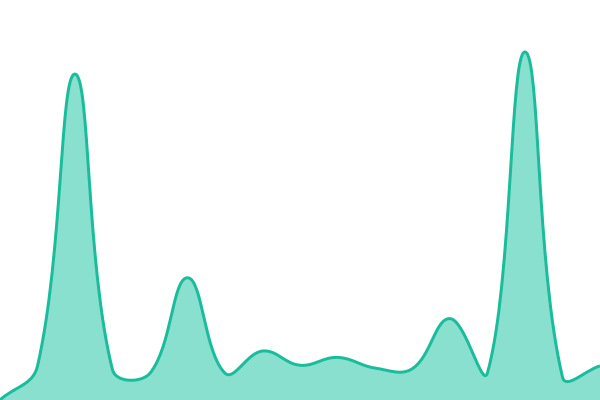 3652ms
     
 | 

<a href="https://HDVinnie.github.io/TrackerHub/history/gazelle-games">99.67%</a>
    

|  GreatPosterWall | 🟩 Up | [great-poster-wall.yml](https://github.com/HDVinnie/TrackerHub/commits/HEAD/history/great-poster-wall.yml) | 

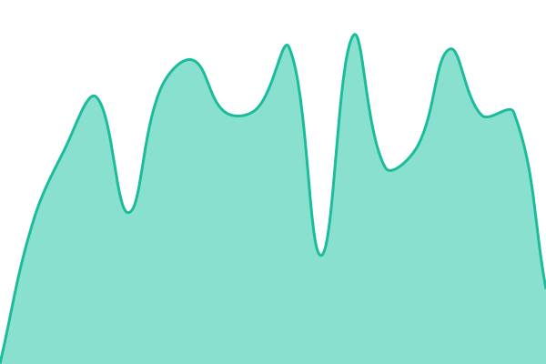 1795ms
     
 | 

<a href="https://HDVinnie.github.io/TrackerHub/history/great-poster-wall">99.66%</a>
    

|  HawkeUno | 🟩 Up | [hawke-uno.yml](https://github.com/HDVinnie/TrackerHub/commits/HEAD/history/hawke-uno.yml) | 

 4676ms
     
 | 

<a href="https://HDVinnie.github.io/TrackerHub/history/hawke-uno">97.59%</a>
    

|  MyAnonaMouse | 🟨 Degraded | [my-anona-mouse.yml](https://github.com/HDVinnie/TrackerHub/commits/HEAD/history/my-anona-mouse.yml) | 

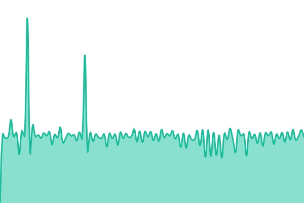 984ms
     
 | 

<a href="https://HDVinnie.github.io/TrackerHub/history/my-anona-mouse">95.78%</a>
    

|  Nebulance | 🟩 Up | [nebulance.yml](https://github.com/HDVinnie/TrackerHub/commits/HEAD/history/nebulance.yml) | 

 1971ms
     
 | 

<a href="https://HDVinnie.github.io/TrackerHub/history/nebulance">100.00%</a>
    

|  OnlyEncodes | 🟩 Up | [only-encodes.yml](https://github.com/HDVinnie/TrackerHub/commits/HEAD/history/only-encodes.yml) | 

 1848ms
     
 | 

<a href="https://HDVinnie.github.io/TrackerHub/history/only-encodes">98.98%</a>
    

|  Orpheus | 🟩 Up | [orpheus.yml](https://github.com/HDVinnie/TrackerHub/commits/HEAD/history/orpheus.yml) | 

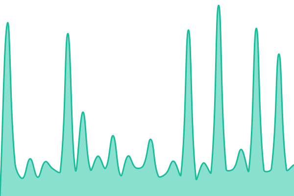 877ms
     
 | 

<a href="https://HDVinnie.github.io/TrackerHub/history/orpheus">99.56%</a>
    

|  PrivateHD | 🟩 Up | [private-hd.yml](https://github.com/HDVinnie/TrackerHub/commits/HEAD/history/private-hd.yml) | 

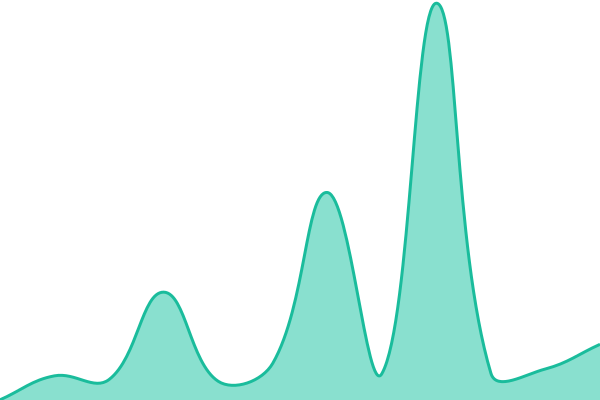 1078ms
     
 | 

<a href="https://HDVinnie.github.io/TrackerHub/history/private-hd">98.85%</a>
    

|  PassThePopcorn | 🟩 Up | [pass-the-popcorn.yml](https://github.com/HDVinnie/TrackerHub/commits/HEAD/history/pass-the-popcorn.yml) | 

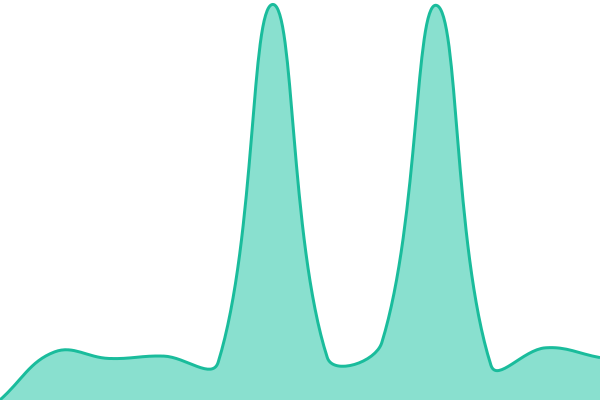 449ms
     
 | 

<a href="https://HDVinnie.github.io/TrackerHub/history/pass-the-popcorn">98.64%</a>
    

|  Redacted | 🟥 Down | [redacted.yml](https://github.com/HDVinnie/TrackerHub/commits/HEAD/history/redacted.yml) | 

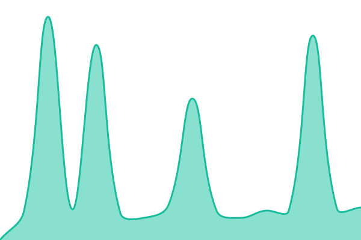 829ms
     
 | 

<a href="https://HDVinnie.github.io/TrackerHub/history/redacted">94.02%</a>
    

|  Secret-Cinema | 🟥 Down | [secret-cinema.yml](https://github.com/HDVinnie/TrackerHub/commits/HEAD/history/secret-cinema.yml) | 

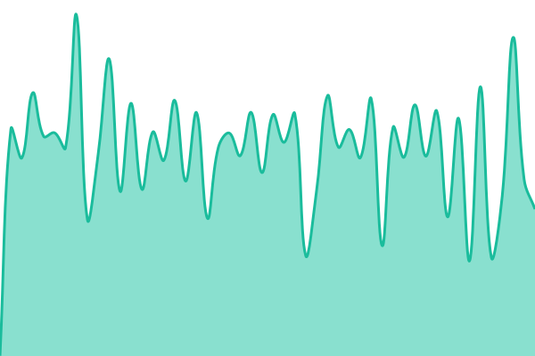 898ms
     
 | 

<a href="https://HDVinnie.github.io/TrackerHub/history/secret-cinema">0.00%</a>
    

|  TorrentLeech | 🟩 Up | [torrent-leech.yml](https://github.com/HDVinnie/TrackerHub/commits/HEAD/history/torrent-leech.yml) | 

 358ms
     
 | 

<a href="https://HDVinnie.github.io/TrackerHub/history/torrent-leech">100.00%</a>
    

<!--end: status pages-->

[**Visit our status website →**](https://HDVinnie.github.io/TrackerHub)

## 📄 License

- Powered by: [Upptime](https://github.com/upptime/upptime)
- Code: [MIT](./LICENSE) © [HDVinnie](https://HDVinnie.github.io/TrackerHub)
- Data in the `./history` directory: [Open Database License](https://opendatacommons.org/licenses/odbl/1-0/)
