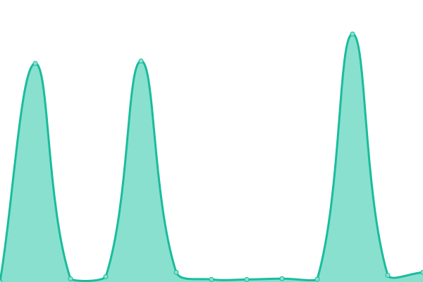

# [📈 Live Status](https://HDVinnie.github.io/TrackerHub): <!--live status--> **🟨 Degraded performance**

This repository contains the open-source uptime monitor and status page for [HDVinnie](https://HDVinnie.github.io/TrackerHub), powered by [Upptime](https://github.com/upptime/upptime).

With [Upptime](https://upptime.js.org), you can get your own unlimited and free uptime monitor and status page, powered entirely by a GitHub repository. We use [Issues](https://github.com/HDVinnie/TrackerHub/issues) as incident reports, [Actions](https://github.com/HDVinnie/TrackerHub/actions) as uptime monitors, and [Pages](https://HDVinnie.github.io/TrackerHub) for the status page.

<!--start: status pages-->
<!-- This summary is generated by Upptime (https://github.com/upptime/upptime) -->
<!-- Do not edit this manually, your changes will be overwritten -->
<!-- prettier-ignore -->
| URL | Status | History | Response Time | Uptime |
| --- | ------ | ------- | ------------- | ------ |
|  Aither | 🟩 Up | [aither.yml](https://github.com/HDVinnie/TrackerHub/commits/HEAD/history/aither.yml) | 

 670ms
     
 | 

<a href="https://HDVinnie.github.io/TrackerHub/history/aither">100.00%</a>
    

|  AlphaRatio | 🟨 Degraded | [alpha-ratio.yml](https://github.com/HDVinnie/TrackerHub/commits/HEAD/history/alpha-ratio.yml) | 

 4352ms
     
 | 

<a href="https://HDVinnie.github.io/TrackerHub/history/alpha-ratio">80.05%</a>
    

|  AnimeBytes | 🟩 Up | [anime-bytes.yml](https://github.com/HDVinnie/TrackerHub/commits/HEAD/history/anime-bytes.yml) | 

 2980ms
     
 | 

<a href="https://HDVinnie.github.io/TrackerHub/history/anime-bytes">100.00%</a>
    

|  Anthelion | 🟩 Up | [anthelion.yml](https://github.com/HDVinnie/TrackerHub/commits/HEAD/history/anthelion.yml) | 

 1954ms
     
 | 

<a href="https://HDVinnie.github.io/TrackerHub/history/anthelion">98.73%</a>
    

|  AsianCinema | 🟩 Up | [asian-cinema.yml](https://github.com/HDVinnie/TrackerHub/commits/HEAD/history/asian-cinema.yml) | 

 836ms
     
 | 

<a href="https://HDVinnie.github.io/TrackerHub/history/asian-cinema">99.92%</a>
    

|  BeyondHD | 🟩 Up | [beyond-hd.yml](https://github.com/HDVinnie/TrackerHub/commits/HEAD/history/beyond-hd.yml) | 

 1617ms
     
 | 

<a href="https://HDVinnie.github.io/TrackerHub/history/beyond-hd">99.63%</a>
    

|  Bibliotik | 🟩 Up | [bibliotik.yml](https://github.com/HDVinnie/TrackerHub/commits/HEAD/history/bibliotik.yml) | 

 235ms
     
 | 

<a href="https://HDVinnie.github.io/TrackerHub/history/bibliotik">100.00%</a>
    

|  Blutopia | 🟩 Up | [blutopia.yml](https://github.com/HDVinnie/TrackerHub/commits/HEAD/history/blutopia.yml) | 

 543ms
     
 | 

<a href="https://HDVinnie.github.io/TrackerHub/history/blutopia">99.70%</a>
    

|  BroadcasTheNet | 🟩 Up | [broadcas-the-net.yml](https://github.com/HDVinnie/TrackerHub/commits/HEAD/history/broadcas-the-net.yml) | 

 1073ms
     
 | 

<a href="https://HDVinnie.github.io/TrackerHub/history/broadcas-the-net">100.00%</a>
    

|  DesiTorrents | 🟩 Up | [desi-torrents.yml](https://github.com/HDVinnie/TrackerHub/commits/HEAD/history/desi-torrents.yml) | 

 5537ms
     
 | 

<a href="https://HDVinnie.github.io/TrackerHub/history/desi-torrents">99.29%</a>
    

|  Empornium | 🟩 Up | [empornium.yml](https://github.com/HDVinnie/TrackerHub/commits/HEAD/history/empornium.yml) | 

 333ms
     
 | 

<a href="https://HDVinnie.github.io/TrackerHub/history/empornium">100.00%</a>
    

|  Exoticaz | 🟩 Up | [exoticaz.yml](https://github.com/HDVinnie/TrackerHub/commits/HEAD/history/exoticaz.yml) | 

 370ms
     
 | 

<a href="https://HDVinnie.github.io/TrackerHub/history/exoticaz">100.00%</a>
    

|  FearNoPeer | 🟩 Up | [fear-no-peer.yml](https://github.com/HDVinnie/TrackerHub/commits/HEAD/history/fear-no-peer.yml) | 

 541ms
     
 | 

<a href="https://HDVinnie.github.io/TrackerHub/history/fear-no-peer">100.00%</a>
    

|  GazelleGames | 🟩 Up | [gazelle-games.yml](https://github.com/HDVinnie/TrackerHub/commits/HEAD/history/gazelle-games.yml) | 

 434ms
     
 | 

<a href="https://HDVinnie.github.io/TrackerHub/history/gazelle-games">95.84%</a>
    

|  GreatPosterWall | 🟩 Up | [great-poster-wall.yml](https://github.com/HDVinnie/TrackerHub/commits/HEAD/history/great-poster-wall.yml) | 

 1010ms
     
 | 

<a href="https://HDVinnie.github.io/TrackerHub/history/great-poster-wall">100.00%</a>
    

|  HawkeUno | 🟩 Up | [hawke-uno.yml](https://github.com/HDVinnie/TrackerHub/commits/HEAD/history/hawke-uno.yml) | 

 501ms
     
 | 

<a href="https://HDVinnie.github.io/TrackerHub/history/hawke-uno">100.00%</a>
    

|  HDBits | 🟩 Up | [hd-bits.yml](https://github.com/HDVinnie/TrackerHub/commits/HEAD/history/hd-bits.yml) | 

 731ms
     
 | 

<a href="https://HDVinnie.github.io/TrackerHub/history/hd-bits">100.00%</a>
    

|  MorethanTV | 🟩 Up | [morethan-tv.yml](https://github.com/HDVinnie/TrackerHub/commits/HEAD/history/morethan-tv.yml) | 

 1523ms
     
 | 

<a href="https://HDVinnie.github.io/TrackerHub/history/morethan-tv">100.00%</a>
    

|  MyAnonaMouse | 🟩 Up | [my-anona-mouse.yml](https://github.com/HDVinnie/TrackerHub/commits/HEAD/history/my-anona-mouse.yml) | 

 684ms
     
 | 

<a href="https://HDVinnie.github.io/TrackerHub/history/my-anona-mouse">100.00%</a>
    

|  Nebulance | 🟩 Up | [nebulance.yml](https://github.com/HDVinnie/TrackerHub/commits/HEAD/history/nebulance.yml) | 

 3277ms
     
 | 

<a href="https://HDVinnie.github.io/TrackerHub/history/nebulance">98.74%</a>
    

|  OnlyEncodes | 🟩 Up | [only-encodes.yml](https://github.com/HDVinnie/TrackerHub/commits/HEAD/history/only-encodes.yml) | 

 651ms
     
 | 

<a href="https://HDVinnie.github.io/TrackerHub/history/only-encodes">100.00%</a>
    

|  Orpheus | 🟩 Up | [orpheus.yml](https://github.com/HDVinnie/TrackerHub/commits/HEAD/history/orpheus.yml) | 

 380ms
     
 | 

<a href="https://HDVinnie.github.io/TrackerHub/history/orpheus">100.00%</a>
    

|  PrivateHD | 🟩 Up | [private-hd.yml](https://github.com/HDVinnie/TrackerHub/commits/HEAD/history/private-hd.yml) | 

 267ms
     
 | 

<a href="https://HDVinnie.github.io/TrackerHub/history/private-hd">100.00%</a>
    

|  PassThePopcorn | 🟩 Up | [pass-the-popcorn.yml](https://github.com/HDVinnie/TrackerHub/commits/HEAD/history/pass-the-popcorn.yml) | 

 568ms
     
 | 

<a href="https://HDVinnie.github.io/TrackerHub/history/pass-the-popcorn">99.80%</a>
    

|  Redacted | 🟩 Up | [redacted.yml](https://github.com/HDVinnie/TrackerHub/commits/HEAD/history/redacted.yml) | 

 1749ms
     
 | 

<a href="https://HDVinnie.github.io/TrackerHub/history/redacted">97.27%</a>
    

|  SceneTime | 🟩 Up | [scene-time.yml](https://github.com/HDVinnie/TrackerHub/commits/HEAD/history/scene-time.yml) | 

 1476ms
     
 | 

<a href="https://HDVinnie.github.io/TrackerHub/history/scene-time">99.80%</a>
    

|  Secret-Cinema | 🟩 Up | [secret-cinema.yml](https://github.com/HDVinnie/TrackerHub/commits/HEAD/history/secret-cinema.yml) | 

 614ms
     
 | 

<a href="https://HDVinnie.github.io/TrackerHub/history/secret-cinema">100.00%</a>
    

|  TorrentLeech | 🟩 Up | [torrent-leech.yml](https://github.com/HDVinnie/TrackerHub/commits/HEAD/history/torrent-leech.yml) | 

 1534ms
     
 | 

<a href="https://HDVinnie.github.io/TrackerHub/history/torrent-leech">99.62%</a>
    

|  UHDBits | 🟩 Up | [uhd-bits.yml](https://github.com/HDVinnie/TrackerHub/commits/HEAD/history/uhd-bits.yml) | 

 611ms
     
 | 

<a href="https://HDVinnie.github.io/TrackerHub/history/uhd-bits">100.00%</a>
    

<!--end: status pages-->

[**Visit our status website →**](https://HDVinnie.github.io/TrackerHub)

## 📄 License

- Powered by: [Upptime](https://github.com/upptime/upptime)
- Code: [MIT](./LICENSE) © [HDVinnie](https://HDVinnie.github.io/TrackerHub)
- Data in the `./history` directory: [Open Database License](https://opendatacommons.org/licenses/odbl/1-0/)
